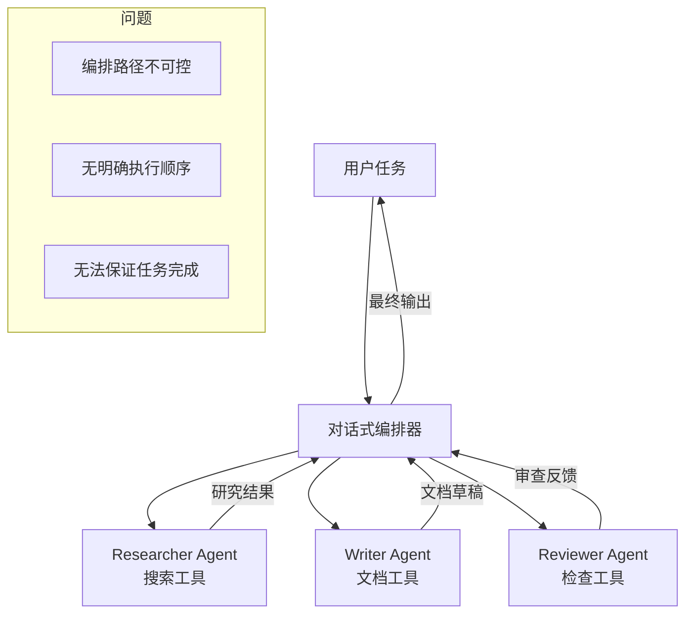

# Multi-Agent 协作系统评估报告示例

> **评价日期**: 2026-04-30  
> **项目类型**: Multi-Agent 协作系统  
> **评价标准**: 基于 2026 年 SOTA Agent 架构标准

---

## 【第 1 块】项目整体概况

### 1.1 项目定位

**一句话定位**: 基于 CrewAI 的多 Agent 协作系统,通过对话式编排实现任务分配和协作执行。

### 1.2 设计思路

| 设计声明 | 来源 |
|:---|:---|
| "使用 CrewAI 实现多 Agent 协作" | README.md |
| "通过对话式编排分配任务" | architecture.md |
| "每个 Agent 有独立的角色和工具" | agent_config.yaml |

### 1.3 整体架构图

---

## 【第 2 块】七大里程碑评估结果

### 2.1 感知层

**评估结果**: 🟡 **部分通过**

**差距分析**:
- ✅ 每个 Agent 可以读取文本输入
- ❌ 无多模态感知(图像、音频)
- ❌ 无环境观察机制
- 🟡 有基本的反馈闭环(通过对话传递信息)

**SOTA 对标**:
- Anthropic Claude Code: 多模态感知 + 环境观察
- Manus: 持续观察环境变化

**改进建议**:
1. 为每个 Agent 添加多模态输入处理
2. 实现环境观察机制(文件监听、UI 截图)
3. 建立结构化的感知-行动-验证闭环

---

### 2.2 大脑层

**评估结果**: ❌ **未通过**

**差距分析**:
- ❌ 使用对话式编排,无明确的 Plan-and-Execute
- ❌ 编排路径不可控,无法保证执行顺序
- ❌ 缺少自反思循环

**核心问题**: CrewAI 的对话式编排是"黑盒",无法预测哪个 Agent 会执行哪个任务,也无法保证任务一定会完成。

**SOTA 对标**:
- LangGraph StateGraph: 明确规划执行路径,条件边控制流程
- Anthropic Claude Managed Agents: 先规划任务,再逐步执行

**改进建议**:
1. **替换编排框架**: 从 CrewAI 迁移到 LangGraph
2. **实现 StateGraph**: 定义明确的执行路径和条件边
3. **添加 Planning 阶段**: 在执行前先规划整体策略

---

### 2.3 协议层

**评估结果**: 🟡 **部分通过**

**差距分析**:
- ✅ 使用 CrewAI 的工具定义(类似 Function Calling)
- 🟡 但工具调用仍依赖对话式编排,可靠性不稳定
- ❌ 无 MCP 协议支持

**SOTA 对标**:
- Anthropic MCP: 通过 schema 强制校验
- OpenAI Function Calling: 结构化函数调用

**改进建议**:
1. 升级到 MCP 协议
2. 或使用 OpenAI Function Calling
3. 确保工具调用的可靠性(不依赖对话编排)

---

### 2.4 行动层

**评估结果**: ❌ **未通过**

**差距分析**:
- ❌ 无异步/并行执行机制
- ❌ 无错误重试机制
- ❌ 无超时控制

**SOTA 对标**:
- Manus: 异步执行 + 错误容错 + 重试机制
- LangGraph: 支持并行节点执行

**改进建议**:
1. 实现异步执行机制(asyncio)
2. 添加错误重试策略(最多 3 次)
3. 设置超时控制(每个 Agent 最多 60 秒)

---

### 2.5 记忆层

**评估结果**: 🟡 **部分通过**

**差距分析**:
- ✅ 有短期记忆(当前对话上下文)
- 🟡 有跨 Agent 的信息传递(通过对话)
- ❌ 无长期记忆存储
- ❌ 无向量检索机制

**SOTA 对标**:
- Hermes: 自进化记忆系统
- Redis AI Agent Memory: 分层管理

**改进建议**:
1. 实现长期记忆存储(向量数据库)
2. 添加记忆检索机制(相似度搜索)
3. 实现跨会话的知识积累

---

### 2.6 工程化

**评估结果**: ❌ **未通过**

**差距分析**:
- ❌ 无上下文滑动窗口
- ❌ 无 Token 成本控制
- ❌ 无自动化评测(Evals)

**SOTA 对标**:
- Anthropic Claude Code: 上下文滑动窗口 + Token 成本控制
- OpenAI Evals: 自动化评测系统

**改进建议**:
1. 实现上下文滑动窗口(保留最近 N 条对话)
2. 添加 Token 计数和成本估算
3. 建立自动化评测系统

---

### 2.7 安全性

**评估结果**: ❌ **未通过**

**差距分析**:
- ❌ 无沙箱隔离
- ❌ 无路径白名单
- ❌ 无敏感操作的人工确认机制

**SOTA 对标**:
- Manus: Sandbox 隔离 + 路径白名单
- GKE Secure AI Agents: 容器化隔离 + Human-in-the-loop

**改进建议**:
1. 实现沙箱隔离(Docker 容器)
2. 设置路径白名单
3. 添加敏感操作确认

---

## 【第 3 块】SOTA 对标差距总结

### 3.1 里程碑通过情况

| 里程碑 | 通过情况 | 主要差距 |
|:---|:---|:---|
| 感知层 | 🟡 | 有基本感知但无多模态 |
| 大脑层 | ❌ | 对话式编排不可控 |
| 协议层 | 🟡 | 有工具定义但可靠性不稳定 |
| 行动层 | ❌ | 无异步执行、无错误容错 |
| 记忆层 | 🟡 | 有短期记忆但无长期记忆 |
| 工程化 | ❌ | 无成本控制、无自动化评测 |
| 安全性 | ❌ | 无沙箱隔离、无路径白名单 |

**总体评分**: 0/7 个里程碑完全通过,3/7 个里程碑部分通过

### 3.2 核心问题识别

**最严重的 3 个问题**:

1. **大脑层编排不可控**: CrewAI 的对话式编排无法保证执行路径,这是生产环境的致命问题
2. **安全性无沙箱**: 多 Agent 协作增加了风险,每个 Agent 都可能执行危险操作
3. **行动层无容错**: 多 Agent 协作的链路更长,每个点都需要独立的错误处理

### 3.3 为什么 CrewAI 不适合生产环境?

**核心问题**: CrewAI 使用"对话式编排",这意味着:
- Agent 之间通过对话传递任务
- 无法预测哪个 Agent 会执行哪个任务
- 无法保证任务一定会完成
- 无法控制执行顺序

**SOTA 对比**:
- LangGraph StateGraph: 明确的执行路径,条件边控制流程
- Anthropic Claude Managed Agents: 先规划任务,再逐步执行

**结论**: CrewAI 适合实验和演示,但不适合生产环境。应该迁移到 LangGraph。

---

## 【第 4 块】参考 SOTA 方案

### 4.1 LangGraph StateGraph 架构

**核心特点**:
- 明确的执行路径(StateGraph)
- 条件边控制流程
- 支持并行节点执行
- 25k stars,被 Klarna、Replit、Elastic 采用

**如何应用到本项目**:
- 将 CrewAI 替换为 LangGraph
- 定义 StateGraph 明确执行路径
- 使用条件边控制 Agent 间的任务传递

### 4.2 Anthropic MCP 多 Agent

**核心特点**:
- MCP 支持多 Agent 协作
- 结构化的工具定义
- 生产级验证

**如何应用到本项目**:
- 使用 MCP 定义每个 Agent 的工具
- 参考 Anthropic 的多 Agent 协作模式

### 4.3 Manus 自主执行

**核心特点**:
- 完全自主执行 + Sandbox 隔离
- 异步执行 + 错误容错

**如何应用到本项目**:
- 参考 Manus 的沙箱隔离设计
- 实现异步执行和错误重试

---

## 【第 5 块】改进路线图

### 短期改进(1-2 周)

1. **大脑层**: 从 CrewAI 迁移到 LangGraph StateGraph
2. **安全性**: 实现沙箱隔离(Docker 容器)
3. **行动层**: 添加异步执行和错误重试

### 中期改进(1-2 月)

4. **协议层**: 升级到 MCP 或 Function Calling
5. **记忆层**: 实现分层记忆管理
6. **工程化**: 实现上下文滑动窗口和 Token 成本控制

### 长期改进(3-6 月)

7. **感知层**: 添加多模态感知能力
8. **工程化**: 建立自动化评测系统
9. **整体**: 对标 LangGraph 实现生产级多 Agent 协作

---

## 【第 6 块】总结

### 6.1 项目优势

- ✅ 实现了多 Agent 协作的基本框架
- ✅ 每个 Agent 有独立的角色和工具
- ✅ 代码结构清晰,易于理解

### 6.2 主要差距

- ❌ 使用 CrewAI 的对话式编排,不适合生产环境
- ❌ 缺少生产级必需的安全机制(沙箱隔离)
- ❌ 缺少明确的执行路径控制

### 6.3 关键决策

**最重要的决策**: 是否从 CrewAI 迁移到 LangGraph?

**分析**:
- CrewAI: 适合实验和演示,但不适合生产环境
- LangGraph: 适合生产环境,有明确的执行路径控制

**建议**: 如果目标是生产环境,必须迁移到 LangGraph。如果只是实验,CrewAI 可以继续使用。

### 6.4 下一步行动

**立即行动**:
1. 评估是否迁移到 LangGraph(基于生产环境需求)
2. 实现沙箱隔离,防止误删文件
3. 添加错误重试机制

**后续规划**:
- 参考 LangGraph StateGraph 重构编排层
- 参考 Anthropic MCP 实现协议层
- 参考 Manus 实现安全隔离