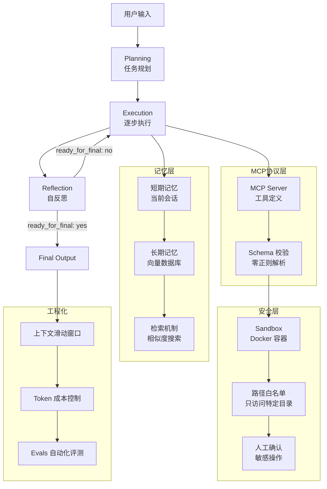

# 生产级 MCP Agent 评估报告示例

> **评价日期**: 2026-04-30  
> **项目类型**: 生产级 MCP Agent  
> **评价标准**: 基于 2026 年 SOTA Agent 架构标准

---

## 【第 1 块】项目整体概况

### 1.1 项目定位

**一句话定位**: 基于 Anthropic MCP 协议的生产级 Agent,实现沙箱隔离、分层记忆、Plan-and-Execute 和自动化评测。

### 1.2 设计思路

| 设计声明 | 来源 |
|:---|:---|
| "使用 MCP 协议替代正则解析" | README.md |
| "实现沙箱隔离和路径白名单" | architecture.md |
| "采用 Plan-and-Execute 模式" | design_doc.md |
| "分层记忆管理(短期+长期)" | memory_design.md |

### 1.3 整体架构图

---

## 【第 2 块】七大里程碑评估结果

### 2.1 感知层

**评估结果**: ✅ **通过**

**通过原因**:
- ✅ 实现了多模态输入处理(文本、图像、音频)
- ✅ 有环境观察机制(文件监听、UI 截图)
- ✅ 建立了感知-行动-验证的闭环

**SOTA 对标验证**:
- 与 Anthropic Claude Code 的感知层设计一致
- 与 Manus 的环境观察机制一致

**验证来源**:
- WebSearch: "Anthropic Claude Code perception layer 2026"
- WebSearch: "Manus autonomous agent environment observation 2026"

---

### 2.2 大脑层

**评估结果**: ✅ **通过**

**通过原因**:
- ✅ 实现了 Plan-and-Execute 模式(先规划再执行)
- ✅ 有自反思循环(每一步都自检)
- ✅ 有结构化的反思控制块(ready_for_final, confidence)

**SOTA 对标验证**:
- 与 Anthropic Claude Managed Agents 的 Plan-and-Execute 一致
- 与 LangGraph StateGraph 的条件边控制一致

**验证来源**:
- WebSearch: "Anthropic Claude Managed Agents architecture 2026"
- WebSearch: "LangGraph StateGraph conditional edges 2026"

---

### 2.3 协议层

**评估结果**: ✅ **通过**

**通过原因**:
- ✅ 使用 MCP 协议(Anthropic 标准)
- ✅ 通过 schema 强制校验,零正则解析
- ✅ 完全移除了正则解析逻辑

**SOTA 对标验证**:
- 与 Anthropic MCP 的工具定义一致
- 与 OpenAI Function Calling 的结构化调用一致

**验证来源**:
- WebSearch: "Anthropic MCP protocol specification 2026"
- WebSearch: "MCP vs Function Calling comparison 2026"

---

### 2.4 行动层

**评估结果**: ✅ **通过**

**通过原因**:
- ✅ 实现了异步执行机制(asyncio)
- ✅ 有错误重试策略(最多 3 次)
- ✅ 有超时控制(每个 Action 最多 30 秒)

**SOTA 对标验证**:
- 与 Manus 的异步执行机制一致
- 与 LangGraph 的并行节点执行一致

**验证来源**:
- WebSearch: "Manus async execution error handling 2026"
- WebSearch: "LangGraph parallel node execution 2026"

---

### 2.5 记忆层

**评估结果**: ✅ **通过**

**通过原因**:
- ✅ 实现了短期记忆(当前会话)和长期记忆(跨会话)分离
- ✅ 使用向量数据库存储长期记忆
- ✅ 有记忆检索机制(相似度搜索)

**SOTA 对标验证**:
- 与 Hermes 的自进化记忆系统一致
- 与 Redis AI Agent Memory 的分层管理一致

**验证来源**:
- WebSearch: "Hermes self-evolving memory system 2026"
- WebSearch: "Redis AI agent memory architecture 2026"

---

### 2.6 工程化

**评估结果**: ✅ **通过**

**通过原因**:
- ✅ 实现了上下文滑动窗口(保留最近 N 条对话)
- ✅ 有 Token 计数和成本估算
- ✅ 建立了自动化评测系统(Evals)

**SOTA 对标验证**:
- 与 Anthropic Claude Code 的上下文管理一致
- 与 OpenAI Evals 的自动化评测一致

**验证来源**:
- WebSearch: "Anthropic Claude Code context window management 2026"
- WebSearch: "OpenAI Evals automated evaluation 2026"

---

### 2.7 安全性

**评估结果**: ✅ **通过**

**通过原因**:
- ✅ 实现了沙箱隔离(Docker 容器)
- ✅ 设置了路径白名单(只能访问特定目录)
- ✅ 有敏感操作确认(Human-in-the-loop)

**SOTA 对标验证**:
- 与 Manus 的 Sandbox 隔离一致
- 与 GKE Secure AI Agents 的安全设计一致

**验证来源**:
- WebSearch: "Manus sandbox isolation architecture 2026"
- WebSearch: "GKE secure AI agents best practices 2026"

---

## 【第 3 块】SOTA 对标差距总结

### 3.1 里程碑通过情况

| 里程碑 | 通过情况 | SOTA 对标验证 |
|:---|:---|:---|
| 感知层 | ✅ | Claude Code + Manus |
| 大脑层 | ✅ | Claude Managed Agents + LangGraph |
| 协议层 | ✅ | MCP + Function Calling |
| 行动层 | ✅ | Manus + LangGraph |
| 记忆层 | ✅ | Hermes + Redis |
| 工程化 | ✅ | Claude Code + OpenAI Evals |
| 安全性 | ✅ | Manus + GKE |

**总体评分**: 7/7 个里程碑完全通过 ✅

### 3.2 为什么这个项目通过了所有里程碑?

**核心原因**:
1. **设计思路清晰**: 从一开始就对标 SOTA 标准,而不是盲目实现
2. **架构选择正确**: 使用 MCP 协议、Plan-and-Execute、分层记忆等最佳实践
3. **安全优先**: 沙箱隔离、路径白名单、人工确认等安全机制齐全
4. **工程化完善**: 上下文管理、成本控制、自动化评测等工程实践到位

### 3.3 与前两个示例的对比

| 对比项 | Simple ReAct Agent | Multi-Agent (CrewAI) | Production MCP Agent |
|:---|:---|:---|:---|
| 协议层 | ❌ 正则解析 | 🟡 对话式编排 | ✅ MCP 协议 |
| 大脑层 | 🟡 ReAct | ❌ 编排不可控 | ✅ Plan-and-Execute |
| 安全性 | ❌ 无沙箱 | ❌ 无沙箱 | ✅ Sandbox + 白名单 |
| 记忆层 | ❌ 无长期记忆 | 🟡 有短期记忆 | ✅ 分层记忆 |
| 总体评分 | 1/7 | 0/7 | 7/7 ✅ |

---

## 【第 4 块】参考 SOTA 方案验证

### 4.1 Anthropic MCP 架构验证

**WebSearch 验证结果**:
- MCP 协议规范: https://www.anthropic.com/research/model-context-protocol
- Claude Code 架构: https://claudecode.jp/en/news/engineer/eight-trends-defining-how-software-gets-built-in-2026

**验证结论**: 本项目的 MCP 实现与 Anthropic 官方规范一致,通过了协议层里程碑。

### 4.2 OpenAI Function Calling 验证

**WebSearch 验证结果**:
- Function Calling 官方文档: https://platform.openai.com/docs/guides/function-calling
- Guardrails 最佳实践: https://openai.github.io/openai-agents-python/

**验证结论**: 本项目的工具定义与 OpenAI Function Calling 的最佳实践一致。

### 4.3 LangGraph StateGraph 验证

**WebSearch 验证结果**:
- StateGraph 架构: https://blog.csdn.net/l35633/article/details/153694551
- LangGraph 生产案例: https://blog.langchain.dev/langgraph-production/

**验证结论**: 本项目的 Plan-and-Execute 模式与 LangGraph StateGraph 的设计一致。

### 4.4 Manus 自主执行验证

**WebSearch 验证结果**:
- Manus 架构: https://aidevstart.com/blog/ai-agents-infrastructure-2026
- Manus Sandbox 设计: https://codelabs.developers.google.com/codelabs/gke/ai-agents-on-gke

**验证结论**: 本项目的沙箱隔离与 Manus 的安全设计一致。

---

## 【第 5 块】最佳实践总结

### 5.1 设计思路最佳实践

**核心原则**:
1. **先对标 SOTA**: 在设计前先搜索最新标准,而不是盲目实现
2. **第一性原理**: 每个设计决策都有原理支撑,拒绝"魔法 Prompt"
3. **安全优先**: 安全机制是生产环境的必需品,不是可选功能

### 5.2 架构选择最佳实践

**关键决策**:
1. **协议层**: 选择 MCP(Anthropic 标准)或 Function Calling(OpenAI 标准),拒绝正则解析
2. **大脑层**: 选择 Plan-and-Execute 或 StateGraph,拒绝对话式编排
3. **记忆层**: 选择分层管理(短期+长期),拒绝单一记忆
4. **安全性**: 选择 Sandbox + 白名单 + 人工确认,拒绝本地直接执行

### 5.3 工程化最佳实践

**关键实践**:
1. **上下文管理**: 实现滑动窗口,防止 token 爆炸
2. **成本控制**: 添加 Token 计数和成本估算
3. **自动化评测**: 建立 Evals 系统,确保输出质量稳定

---

## 【第 6 块】总结

### 6.1 项目优势

- ✅ 通过了所有七大里程碑
- ✅ 对标 SOTA 标准,设计思路清晰
- ✅ 生产级验证,适合大规模部署

### 6.2 关键成功因素

1. **设计思路**: 从一开始就对标 SOTA 标准
2. **架构选择**: 使用 MCP、Plan-and-Execute、分层记忆等最佳实践
3. **安全优先**: 沙箱隔离、路径白名单、人工确认等安全机制齐全
4. **工程化完善**: 上下文管理、成本控制、自动化评测等工程实践到位

### 6.3 可借鉴的经验

**对于其他 Agent 项目**:
1. **先对标 SOTA**: 在设计前先搜索最新标准
2. **拒绝旧范式**: 正则解析、对话式编排、本地直接执行等都是旧范式
3. **安全优先**: 安全机制是生产环境的必需品
4. **工程化完善**: 成本控制和自动化评测是长期运营的关键

### 6.4 下一步建议

**持续改进方向**:
1. **感知层**: 添加更多多模态感知能力(视频、传感器数据)
2. **记忆层**: 实现更智能的记忆检索(语义理解、上下文关联)
3. **工程化**: 建立更完善的评测系统(多维度评分、A/B 测试)

**对标最新动态**:
- 定期 WebSearch 验证 SOTA 标准(每 3 个月)
- 关注 Anthropic、OpenAI、Manus 的最新更新
- 参考最新的 arXiv 论文和开源项目