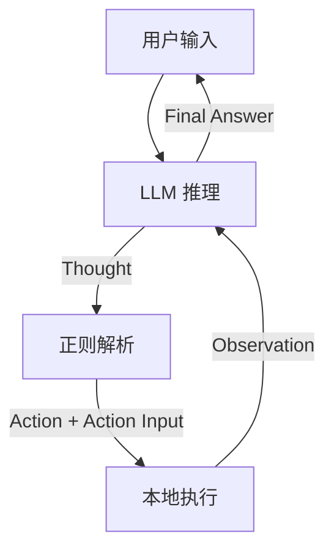

# Simple ReAct Agent 评估报告示例

> **评价日期**: 2026-04-30  
> **项目类型**: 基础 ReAct Agent  
> **评价标准**: 基于 2026 年 SOTA Agent 架构标准

---

## 【第 1 块】项目整体概况

### 1.1 项目定位

**一句话定位**: 基于 ReAct 模式的简单本地 Agent,通过 Thought-Action-Observation 循环实现自主任务执行。

### 1.2 设计思路

| 设计声明 | 来源 |
|:---|:---|
| "使用 ReAct 模式进行推理和行动" | README.md |
| "通过正则解析提取 Action 和 Action Input" | main.py |
| "本地执行,无沙箱隔离" | 架构设计 |

### 1.3 整体架构图



---

## 【第 2 块】七大里程碑评估结果

### 2.1 感知层

**评估结果**: ❌ **未通过**

**差距分析**:
- 只能读取文本输入,无法处理图像、音频等多模态信息
- 没有环境观察机制,无法感知文件变化、UI 状态等
- 缺少反馈闭环,无法验证行动是否有效

**SOTA 对标**:
- Anthropic Claude Code: 可以"看"终端输出、"听"用户指令、"感知"文件变化
- Manus: 持续观察环境变化,实现完全自主执行

**改进建议**:
1. 添加多模态输入处理能力(图像、音频)
2. 实现环境观察机制(文件监听、UI 截图)
3. 建立感知-行动-验证的闭环

---

### 2.2 大脑层

**评估结果**: 🟡 **部分通过**

**差距分析**:
- ✅ 实现了 ReAct 循环(Thought-Action-Observation)
- ❌ 缺少 Plan-and-Execute(先规划再执行)
- ❌ 缺少自反思循环(每一步都自检)

**SOTA 对标**:
- Anthropic Claude Managed Agents: 先规划任务,再逐步执行
- LangGraph StateGraph: 明确规划执行路径,条件边控制流程

**改进建议**:
1. 在 ReAct 循环前添加 Planning 阶段
2. 在 Observation 后添加 Reflection 阶段
3. 实现结构化的反思控制块(ready_for_final, confidence)

---

### 2.3 协议层

**评估结果**: ❌ **未通过**

**差距分析**:
- 使用正则解析提取 Action 和 Action Input
- 正则解析依赖模型输出格式的稳定性
- 这是 2022-2023 年的旧范式,不是 2026 SOTA

**SOTA 对标**:
- Anthropic MCP: 通过 schema 强制校验,从根本上消除格式解析失败风险
- OpenAI Function Calling: 结构化函数调用,零正则解析

**改进建议**:
1. 升级到 MCP 协议(Anthropic 标准)
2. 或使用 OpenAI Function Calling(实践标准)
3. 完全移除正则解析逻辑

---

### 2.4 行动层

**评估结果**: ❌ **未通过**

**差距分析**:
- 本地直接执行,无异步/并行机制
- 无错误重试机制
- 无超时控制

**SOTA 对标**:
- Manus: 异步执行 + 错误容错 + 重试机制
- LangGraph: 支持并行节点执行

**改进建议**:
1. 实现异步执行机制(asyncio)
2. 添加错误重试策略(最多 3 次)
3. 设置超时控制(每个 Action 最多 30 秒)

---

### 2.5 记忆层

**评估结果**: ❌ **未通过**

**差距分析**:
- 只有当前会话的上下文记忆
- 无长期记忆存储
- 无跨会话知识积累

**SOTA 对标**:
- Hermes: 自进化记忆系统,$1B 估值
- Redis AI Agent Memory: 分层管理(向量长时记忆 vs 上下文短时记忆)

**改进建议**:
1. 实现短期记忆(当前会话)和长期记忆(跨会话)分离
2. 使用向量数据库存储长期记忆
3. 实现记忆检索机制(相似度搜索)

---

### 2.6 工程化

**评估结果**: ❌ **未通过**

**差距分析**:
- 无上下文滑动窗口,容易 token 爆炸
- 无 Token 成本控制
- 无自动化评测(Evals)

**SOTA 对标**:
- Anthropic Claude Code: 上下文滑动窗口 + Token 成本控制
- OpenAI Evals: 自动化评测系统

**改进建议**:
1. 实现上下文滑动窗口(保留最近 N 条对话)
2. 添加 Token 计数和成本估算
3. 建立自动化评测系统(测试集 + 评分标准)

---

### 2.7 安全性

**评估结果**: ❌ **未通过**

**差距分析**:
- 本地直接执行,无沙箱隔离
- 无路径白名单,可能误删文件
- 无敏感操作的人工确认机制

**SOTA 对标**:
- Manus: Sandbox 隔离 + 路径白名单
- GKE Secure AI Agents: 容器化隔离 + Human-in-the-loop

**改进建议**:
1. 实现沙箱隔离(Docker 容器)
2. 设置路径白名单(只能访问特定目录)
3. 添加敏感操作确认(删除文件、执行代码等)

---

## 【第 3 块】SOTA 对标差距总结

### 3.1 里程碑通过情况

| 里程碑 | 通过情况 | 主要差距 |
|:---|:---|:---|
| 感知层 | ❌ | 无多模态感知、无环境观察 |
| 大脑层 | 🟡 | 有 ReAct 但无 Plan-and-Execute |
| 协议层 | ❌ | 正则解析(2022范式) |
| 行动层 | ❌ | 无异步执行、无错误容错 |
| 记忆层 | ❌ | 无长期记忆、无分层管理 |
| 工程化 | ❌ | 无成本控制、无自动化评测 |
| 安全性 | ❌ | 无沙箱隔离、无路径白名单 |

**总体评分**: 1/7 个里程碑完全通过

### 3.2 核心问题识别

**最严重的 3 个问题**:

1. **协议层正则解析**: 这是 2022 年的旧范式,应该升级到 MCP 或 Function Calling
2. **安全性无沙箱**: 本地直接执行存在误删文件、泄露数据的风险
3. **记忆层无长期记忆**: 无法跨会话积累知识,每次都从零开始

### 3.3 改进优先级建议

```
改进优先级排序:

1. 【安全性】(最高优先级)
   - 原因: 无沙箱隔离可能导致严重后果(误删文件、数据泄露)
   - 改进: 实现沙箱隔离 + 路径白名单

2. 【协议层】(高优先级)
   - 原因: 正则解析是旧范式,可靠性差
   - 改进: 升级到 MCP 或 Function Calling

3. 【记忆层】(高优先级)
   - 原因: 无长期记忆导致无法积累知识
   - 改进: 实现分层记忆管理
```

---

## 【第 4 块】参考 SOTA 方案

### 4.1 Anthropic MCP 架构

**核心特点**:
- MCP 是开放标准,Anthropic 是标准制定者
- 通过 schema 强制校验,零正则解析
- 生产级验证,Claude Code 经过大规模使用

**如何应用到本项目**:
- 将正则解析替换为 MCP 工具定义
- 使用 MCP schema 定义 Action 和 Action Input
- 参考 Claude Code 的感知层设计

### 4.2 OpenAI Function Calling

**核心特点**:
- Function Calling 是实践标准
- 结构化函数调用,可靠性高
- Guardrails 安全护栏机制

**如何应用到本项目**:
- 使用 OpenAI Chat Completions API 的 function_call 参数
- 定义 tools schema 替代正则解析
- 参考 OpenAI 的 Guardrails 实现安全控制

### 4.3 Manus 自主执行

**核心特点**:
- 完全自主执行 + Sandbox 隔离
- 持续观察环境变化
- 异步执行 + 错误容错

**如何应用到本项目**:
- 参考 Manus 的沙箱隔离设计
- 实现环境观察机制
- 添加异步执行和错误重试

---

## 【第 5 块】改进路线图

### 短期改进(1-2 周)

1. **安全性**: 实现沙箱隔离(Docker 容器)
2. **协议层**: 升级到 MCP 或 Function Calling
3. **行动层**: 添加异步执行和错误重试

### 中期改进(1-2 月)

4. **记忆层**: 实现分层记忆管理
5. **大脑层**: 添加 Plan-and-Execute
6. **工程化**: 实现上下文滑动窗口和 Token 成本控制

### 长期改进(3-6 月)

7. **感知层**: 添加多模态感知能力
8. **工程化**: 建立自动化评测系统
9. **整体**: 对标 Manus 实现完全自主执行

---

## 【第 6 块】总结

### 6.1 项目优势

- ✅ 实现了 ReAct 循环的基本逻辑
- ✅ 代码结构清晰,易于理解和改进
- ✅ 本地执行,部署简单

### 6.2 主要差距

- ❌ 使用 2022 年的旧范式(正则解析)
- ❌ 缺少生产级必需的安全机制(沙箱隔离)
- ❌ 缺少长期记忆和知识积累能力

### 6.3 下一步行动

**立即行动**:
1. 实现沙箱隔离,防止误删文件
2. 升级协议层,移除正则解析
3. 添加错误重试机制

**后续规划**:
- 参考 Anthropic MCP 架构重构协议层
- 参考 Manus 实现自主执行和安全隔离
- 参考 Hermes 实现分层记忆管理